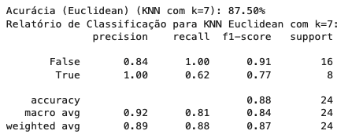
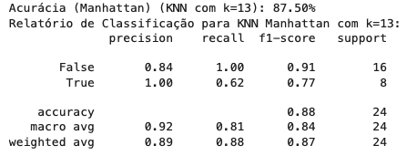

# Relatório 
Aluno: Joaquim Chianca
## Introdução
As apostas esportivas têm uma história longa no Brasil, começando no período colonial com jogos trazidos pelos europeus. Ao longo dos anos, o mercado passou por diversas mudanças, com momentos de legalização e proibição. Atualmente, as apostas esportivas estão em alta, especialmente nas plataformas online, que oferecem uma grande variedade de opções para os brasileiros, de futebol a reality shows. Esse crescimento é impulsionado pela tecnologia digital, que trouxe novas formas de interagir com o mercado.

Machine Learning (ML), ou aprendizado de máquina, é uma área da inteligência artificial que permite que sistemas aprendam a partir de dados e tomem decisões automaticamente. Desde os primeiros testes nos anos 1950, o ML evoluiu muito e hoje é utilizado em diversas aplicações, como recomendações de conteúdo e carros autônomos. O ML é essencial para analisar grandes volumes de dados e identificar padrões sem intervenção humana, tornando-se cada vez mais presente em nossas vidas.

A união entre apostas esportivas e Machine Learning está transformando o setor. No mercado de apostas, ML é usado para criar modelos preditivos que ajudam os apostadores a fazer previsões mais precisas sobre os resultados dos jogos. Algoritmos analisam dados históricos e desempenho dos jogadores, permitindo uma análise mais detalhada das probabilidades.

Este projeto visa utilizar Machine Learning para prever a quantidade de pontos que um jogador da NBA, a liga de basquete mais famosa do mundo, fará em uma partida. Focando no desempenho de LeBron James, o objetivo é desenvolver modelos que possam prever com precisão se ele marcará mais ou menos que 26.5 pontos em um jogo (isso é um exemplo, o modelo pode ser usado com qualquer jogador da liga e com qualquer quantidade de pontos). Essa análise busca aplicar técnicas de aprendizado de máquina em um contexto esportivo, oferecendo insights sobre o desempenho de jogadores e auxiliando em decisões baseadas em dados.

## Metodologia
A pergunta motivadora do estudo: **O Lebron James ultrapassa ou não a quantidade de 26.5 pontos na próxima partida?**

Essa pergunta caracteriza como um problema de classificação, já que o jogador estará em um grupo (ultrapassa a quantidade de pontos) ou noutro (não ultrapassa a quantidade de pontos definida).

Para tal, usaremos algoritmos de treinamento destinados à criação de modelos que abordam esse problema de classifição. A ideia é usar um [conjunto de dados](https://www.kaggle.com/datasets/eduardopalmieri/5555555) disponibilizados no Kaggle.

O projeto será feito no ambiente do [Jupyter Notebook](https://www.alura.com.br/artigos/conhecendo-o-jupyter-notebook?srsltid=AfmBOoqcqW3XyAtJpAk5TAKvH8tokP0Mb89rS8GJZ_CmG5OFFe7F0j6P), portanto, são utilizadas bibliotecas conceituadas da linguagem de programação Python.

### Condução do projeto
O projeto segue os seguintes passos:

1. Limpeza e pré-processamento dos dados
2. Treinamento de modelos a partir de 4 algoritmos e combinação de modelos em um Ensemble
3. Visualização e interpretação dos resultados

Para cada algoritmo, foram criados no mínimo 3 modelos, cada um com hiperparâmetros diferentes, explicitados no arquivo do Jupyter Notebook.

Além disso, o modelo com melhor desempenho é utilizado em um programa escrito em Python, para que o modelo seja utilizado por um usuário final, com intuito de responder a mesma pergunta motivadora para os demais jogadores e com quaisquer limite de pontos estabelecido.

### Limpeza e tratamento dos dados
O dataset possui informações sobre todas partidas de todos os jogadores da temporada 23/24 da NBA. Dentre algumas informações temos pontos na partida, arremessos tentados (de 2 e 3 pontos), rebotes, assistências, roubos de bola, tocos e eficiência de um jogador. 

Os dados foram lidos por meio da biblioteca `pandas` e a limpeza deles seguem a seguinte lógica:

- Remoção de jogadores com menos de 16 jogos, já que uma temporada regular de basquete possui 82 jogos.
- Remoção de colunas irrelevantes, como data do jogo e time de um jogador, pois não influenciam de fato na pontuação de um jogador em quadra. 

### Algoritmos utilizados
- **k-Nearest Neighbors (kNN):** um algoritmo de aprendizado de máquina supervisionado que não faz suposições sobre a distribuição dos dados. Baseia-se na ideia de que pontos de dados semelhantes estão próximos um do outro. O KNN usa a proximidade para classificar ou prever o valor de um novo ponto de dados, considerando os 'k' pontos mais próximos.
- **Árvores de Decisão:** algoritmo preditivo que utiliza uma estrutura de árvore ou lógica condicional (if-else) para tomar decisões. Começando pela raiz da árvore, cada nível representa uma decisão que divide os dados com base em um critério específico, conduzindo a folhas que representam as classificações ou previsões finais.
- **Random Forest:** [ensemble](https://medium.com/dados-e-saude/machine-learning-e-ensembles-780f3a8aa36d) de árvores de decisão. Funciona treinando múltiplas árvores de decisão com subconjuntos dos dados de treinamento e então agregando suas previsões. Esse método melhora a precisão e controla o overfitting, sendo eficaz para grandes conjuntos de dados.
- **Gradient Boost Machine (GBM):** técnica de boosting que constrói modelos de forma sequencial, onde cada novo modelo tenta corrigir os erros do modelo anterior. Baseia-se em otimização gradiente, ajustando-se iterativamente para minimizar uma função de perda.

Por fim, é feita uma tentativa de combinar os vários modelos treinados num processo de criação de Ensemble (combinação de vários modelos), usando o `VotingClassifier` da biblioteca `sklearn`. O VotingClassifier é um modelo que combina as previsões de diversos modelos para determinar a saída final com base na classe que mais frequentemente é escolhida pelos modelos individuais.

### Visualização de respostas
Visualizar números e texto não é a maneira mais intuitiva de entender informação para os humanos, portanto, foram criados gráficos utilizando a biblioteca `matplotlib.pyplot` do ecossistema Python.

### Métricas de avaliação dos modelos
Os modelos são avaliados a partir de quatro principais métricas: acurácia, precisão, recall e F1-Score. Essas métricas ajudam a medir o desempenho dos algoritmos de machine learning no contexto do projeto, que busca prever se um jogador da NBA, como LeBron James, fará mais de 26.5 pontos em uma partida.

No projeto, o resultado previsto pode ser classificado como True (quando o modelo prevê que o jogador fará mais de 26.5 pontos) ou False (quando o modelo prevê que o jogador fará menos de 26.5 pontos).

- **Acurácia**: Representa a proporção de todas as previsões corretas em relação ao total de previsões feitas. Ou seja, quantas vezes o modelo acertou, tanto quando previu que LeBron faria mais de 26.5 pontos, quanto quando previu que ele não ultrapassaria essa marca.

- **Precisão**: Mede a confiabilidade das previsões de que LeBron fará mais de 26.5 pontos. Ela responde à pergunta: “Das vezes que o modelo previu que ele faria mais de 26.5 pontos, quantas vezes isso realmente aconteceu?”.

- **Recall**: Avalia a capacidade do modelo de identificar corretamente os jogos em que LeBron realmente marcou mais de 26.5 pontos. Em outras palavras, das vezes que ele de fato ultrapassou essa pontuação, quantas vezes o modelo foi capaz de prever corretamente?

- **F1-Score**: É a média harmônica entre precisão e recall. O F1-Score é importante para equilibrar essas duas métricas, especialmente em situações onde o modelo pode errar ao prever tanto para mais quanto para menos. Um F1-Score alto indica que o modelo tem um bom desempenho geral.

## Resultados
### K-Nearest Neighbors (kNN)

Para este algoritmo, foram criados diversos modelos, buscando entender qual seria o número ótimo de vizinhos (k) para cada métrica (Euclidiana ou Manhattan). Feito isso, consideramos a melhor acurácia dentre os números testados (3, 5, 7, 9, 11, 13).

O algoritmo K-Nearest Neighbors (KNN) é uma abordagem simples e intuitiva, especialmente eficaz em problemas de classificação, como no caso deste projeto. Os resultados obtidos para o KNN com as distâncias Euclidean e Manhattan, ambos com acurácia de 87.50%, mostram que este algoritmo pode ser uma escolha robusta para a tarefa de prever se LeBron James marcará mais de 26.5 pontos em uma partida.

Os pontos fortes do KNN ficam evidentes na alta acurácia e precisão para a classe "True" (quando LeBron ultrapassa os 26.5 pontos), com valores de 1.00 em ambos os relatórios de classificação. Isso indica que, quando o KNN prevê que LeBron ultrapassará a marca, ele acerta todas as vezes, o que é crucial para decisões onde esses acertos são prioritários. Além disso, a simplicidade do algoritmo e sua natureza não-paramétrica, que não requer suposições sobre a distribuição dos dados, contribuem para sua eficácia em diferentes contextos de dados.

No entanto, o KNN também apresenta fraquezas. O recall para a classe "True" é relativamente baixo, em 0.62, o que significa que o modelo deixa de identificar corretamente 38% dos casos em que LeBron realmente faz mais de 26.5 pontos. Esse aspecto é crucial, pois em cenários onde é importante não perder nenhuma ocorrência positiva, essa limitação pode ser um problema. Além disso, o KNN pode se tornar ineficiente em grandes conjuntos de dados, pois ele precisa calcular a distância de cada ponto de teste em relação a todos os pontos de treino, o que pode levar a um alto custo computacional.

Assim, enquanto o KNN apresenta bons resultados em termos de acurácia e precisão, sua limitação em recall e o custo computacional em cenários com grandes volumes de dados podem ser fatores a considerar ao decidir sobre o uso desse algoritmo em problemas similares.

### Árvores de Decisão

Os modelos de Árvore de Decisão apresentaram resultados variáveis em termos de acurácia, precisão e recall, refletindo suas capacidades distintas de prever se LeBron James ultrapassará a marca de 26.5 pontos em uma partida. O primeiro modelo, com acurácia de 70.83%, mostrou desempenho inferior em comparação aos outros dois, que atingiram 83.33%. Isso indica que os Modelos 2 e 3 são mais eficazes em capturar corretamente as tendências do desempenho de LeBron.

Um ponto forte dos Modelos 2 e 3 é a alta precisão de 1.00 para a classe "False", o que significa que quando o modelo prevê que LeBron não ultrapassará 26.5 pontos, ele está sempre certo. Além disso, o recall para a classe "True" é de 1.00 nesses dois modelos, indicando que eles conseguem identificar todos os jogos em que LeBron realmente ultrapassa a marca. Isso é crucial em cenários onde perder uma previsão de alto desempenho pode ter consequências significativas, como em apostas esportivas.

No entanto, os Modelos 2 e 3, apesar de sua alta precisão e recall, apresentam uma pequena queda em termos de equilíbrio entre as classes, especialmente visível na precisão para a classe "True", que é de 0.67. Isso sugere que, embora sejam confiáveis para prever quando LeBron ultrapassa o limite de pontos, eles ainda cometem alguns erros ao prever que ele o fará, resultando em falsos positivos.

O Modelo 1, por outro lado, tem uma distribuição mais equilibrada entre precisão e recall para ambas as classes, mas à custa de uma menor acurácia geral. Esse equilíbrio pode ser útil em situações onde é necessário considerar tanto os casos em que LeBron ultrapassa quanto os casos em que ele não ultrapassa o limite de pontos, mas o modelo ainda não atinge a mesma eficácia geral que os outros dois. Portanto, dependendo do foco do projeto—seja ele evitar falsos negativos ou minimizar falsos positivos—um desses modelos pode ser mais adequado.

### Random Forest

O algoritmo Random Forest, nos quatro modelos analisados, demonstrou resultados bastante sólidos, com acurácias variando entre 91.67% e 95.83%. Este alto desempenho reflete a robustez do Random Forest em capturar padrões complexos nos dados. Um dos principais pontos fortes deste algoritmo é a sua capacidade de combinar múltiplas árvores de decisão para reduzir o overfitting, o que é evidente na consistência das métricas de precisão e recall. A precisão para a classe "True" é de 1.00 em todos os modelos, indicando que, quando o modelo prevê que LeBron James marcará mais de 26.5 pontos, ele acerta sempre. Além disso, o recall para "False" (quando o modelo prevê corretamente que ele não ultrapassa a pontuação) é consistentemente alto, atingindo 1.00, o que mostra a eficácia do algoritmo em identificar corretamente as partidas onde LeBron não atinge o limite de pontos.

No entanto, o Random Forest apresenta algumas limitações no contexto deste projeto. O recall para a classe "True" (quando LeBron realmente faz mais de 26.5 pontos) varia entre 0.75 e 0.88, indicando que o modelo ainda perde uma pequena porcentagem das partidas onde ele ultrapassa essa pontuação. Isso pode ser um ponto fraco se o objetivo principal for não perder nenhuma dessas ocorrências, pois mesmo com uma precisão alta, a ausência de um recall perfeito significa que o modelo pode não capturar todos os momentos importantes.

Outro ponto a considerar é a possível complexidade computacional associada ao Random Forest. Embora os resultados sejam muito bons, especialmente em comparação com o KNN, o Random Forest exige mais recursos computacionais devido à necessidade de construir e avaliar múltiplas árvores de decisão. Em um contexto onde a rapidez na geração de previsões é essencial, isso pode ser uma desvantagem, especialmente se o volume de dados aumentar significativamente.

Em resumo, o Random Forest se destaca pela alta precisão e consistência na acurácia, tornando-o um algoritmo altamente confiável para a previsão de pontuações no contexto deste projeto. No entanto, a ligeira perda de recall para a classe "True" e a maior demanda computacional são fatores que devem ser considerados ao aplicar este algoritmo em cenários futuros.

### Gradient Boosting Machine

O Gradient Boosting Machine (GBM) é um algoritmo de aprendizado supervisionado que se destaca pela capacidade de construir modelos poderosos através da combinação de múltiplas árvores de decisão, treinadas sequencialmente para corrigir os erros das anteriores. Nos três modelos apresentados, o GBM alcançou uma acurácia impressionante de 95.83%, indicando que o modelo é altamente eficaz na tarefa de prever se LeBron James marcará mais de 26.5 pontos em uma partida. Este alto nível de acurácia sugere que o modelo tem uma excelente capacidade de generalização, conseguindo fazer previsões corretas na maioria das vezes.

Um dos pontos fortes do GBM é sua alta precisão para a classe "True" (quando LeBron ultrapassa os 26.5 pontos), atingindo 1.00 em todos os modelos. Isso significa que, quando o modelo prevê que LeBron marcará mais de 26.5 pontos, ele sempre acerta. Além disso, o recall de 0.88 para essa classe indica que o modelo é bastante eficiente em capturar a maioria dos jogos em que LeBron realmente ultrapassa essa pontuação. Combinando esses fatores, o F1-Score elevado, que varia entre 0.93 e 0.97, reforça a robustez do modelo ao equilibrar precisão e recall.

No entanto, apesar do excelente desempenho geral, o recall de 0.88 para a classe "True" revela uma pequena fraqueza: o modelo deixa de identificar corretamente 12% dos casos em que LeBron ultrapassa os 26.5 pontos. Embora essa margem de erro seja pequena, ela pode ser significativa em contextos onde é crucial não perder nenhuma previsão positiva. Esse aspecto precisa ser considerado, especialmente se o objetivo do projeto for minimizar falsos negativos, onde jogos importantes poderiam ser subestimados.

Em suma, o GBM demonstra ser um modelo extremamente eficaz para este projeto, oferecendo alta precisão e acurácia. Contudo, a leve queda no recall para previsões positivas sugere que, embora o modelo seja altamente confiável, ainda há espaço para pequenos ajustes que poderiam garantir que todos os jogos onde LeBron ultrapassa os 26.5 pontos sejam corretamente identificados.

### Ensemble
Motivado pela curiosidade, o projeto ainda aborda a criação de um ensemble com os modelos criados a partir de outros algoritmos. O modelo de ensemble com o `VotingClassifier` do `sklearn.ensemble`, combinando três modelos de Gradient Boosting Machine (GBM) e três de Random Forest (RF) para realizar predições através de votação majoritária (modo 'hard'). A utilização de um modelo ensemble é uma abordagem poderosa em machine learning. Ele combina as vantagens de múltiplos modelos, ajudando a capturar padrões que um modelo individual pode não perceber. Isso geralmente resulta em uma maior robustez e resiliência a erros, uma vez que diferentes modelos podem compensar as fraquezas uns dos outros.

No entanto, no caso deste ensemble, a precisão não aumentou em relação aos melhores modelos individuais. Isso pode ser explicado pelo fato de que os modelos que compõem o ensemble (Random Forest e GBM) já são algoritmos robustos por natureza, utilizando técnicas de ensemble internamente. Esses algoritmos já alcançaram um nível muito alto de acurácia e precisão, o que limita o potencial de melhoria adicional quando combinados em um ensemble externo.

Em situações onde os modelos individuais já estão altamente otimizados e fornecem previsões muito precisas, o ensemble tende a consolidar essa alta performance sem necessariamente elevá-la, pois não há muitos erros a serem corrigidos entre os modelos. Assim, o ensemble oferece estabilidade e confiança nas previsões, mantendo o excelente desempenho, mas sem um ganho significativo de precisão adicional.

O ensemble criado manteve a alta performance dos modelos individuais, destacando-se como uma ferramenta confiável e robusta para a tarefa de prever o desempenho pontual de LeBron James. Embora não tenha conseguido aumentar a precisão além dos melhores modelos individuais, ele garantiu uma previsão consistente e equilibrada, confirmando o valor da abordagem de ensemble em cenários onde a combinação de modelos altamente performáticos pode consolidar e sustentar a excelência preditiva.

## Conclusão

A análise dos diversos modelos de machine learning, incluindo Árvore de Decisão, Random Forest, Gradient Boosting Machines (GBM) e o Ensemble, revelou insights importantes sobre sua capacidade de prever se LeBron James marcará mais de 26.5 pontos em uma partida. Todos os modelos testados mostraram um desempenho robusto, com acurácias variando de 70.83% a 95.83%, mas a capacidade de responder à pergunta com precisão variou entre os diferentes algoritmos.

Os modelos de **Árvore de Decisão** mostraram uma melhoria significativa do Modelo 1 para os Modelos 2 e 3, com acurácias subindo de 70.83% para 83.33%. Esses modelos foram eficazes ao capturar corretamente as partidas em que LeBron não ultrapassou os 26.5 pontos (alta precisão para a classe "False"), mas tiveram dificuldades em identificar todas as vezes que ele ultrapassou essa marca, refletido em um recall moderado para a classe "True". Esses resultados indicam que, enquanto as Árvores de Decisão são rápidas e interpretáveis, elas podem não ser as mais confiáveis para prever corretamente as partidas em que LeBron excede a pontuação alvo.

O **Random Forest** e o **GBM** elevaram a barra, ambos alcançando uma acurácia de 95.83%. Esses modelos se destacaram pela capacidade de capturar todas as vezes que LeBron não ultrapassou os 26.5 pontos, sem erros (recall de 100% para "False"), e foram muito precisos ao prever quando ele ultrapassaria essa marca (precisão de 100% para "True"). No entanto, ambos os algoritmos apresentaram um pequeno déficit ao perder cerca de 12% das ocorrências reais onde LeBron ultrapassou os 26.5 pontos, demonstrando que, embora poderosos, ainda há um pequeno espaço para melhoria na sensibilidade para capturar todos os verdadeiros positivos.

O algoritmo **K-Nearest Neighbors (KNN)** também foi testado e apresentou um desempenho notável, com acurácias de 87.50% tanto com a métrica Euclidean quanto com a Manhattan. O KNN mostrou-se eficaz em prever quando LeBron James não ultrapassaria os 26.5 pontos, com uma precisão de 84% para a classe "False" e um recall de 100%, o que significa que todas as previsões de que ele não ultrapassaria a marca estavam corretas. No entanto, o KNN enfrentou dificuldades em capturar todas as vezes que LeBron realmente ultrapassou os 26.5 pontos, com um recall de 62% para a classe "True". Isso sugere que o modelo perdeu uma parte significativa das partidas onde ele ultrapassou a pontuação, resultando em um f1-score moderado de 77% para essa classe. Embora o KNN seja simples e intuitivo, sua sensibilidade reduzida para captar todos os verdadeiros positivos limita sua eficácia em cenários onde a captura de todos os casos em que LeBron excede a pontuação é crítica. Assim, apesar de sua alta acurácia, o KNN pode não ser a melhor escolha para este projeto, quando comparado com modelos mais sofisticados como o GBM.

O modelo **Ensemble**, que combinou os melhores algoritmos (Random Forest e GBM), manteve a alta acurácia de 95.83% e mostrou-se robusto ao consolidar as previsões dos modelos individuais. Entretanto, o ensemble não conseguiu superar os modelos isolados em termos de precisão ou recall, uma vez que esses algoritmos já estavam altamente otimizados e complementavam-se pouco em termos de correção de erros. Ainda assim, o ensemble ofereceu uma maior confiabilidade nas previsões, mantendo a consistência e minimizando o risco de erros, o que é valioso em contextos onde a estabilidade do modelo é crucial.

Considerando todas as métricas analisadas e a importância de prever corretamente tanto quando LeBron ultrapassa quanto quando não ultrapassa os 26.5 pontos, o **GBM Modelo 2** se destaca como a escolha mais equilibrada. Ele apresenta um excelente equilíbrio entre precisão e recall, especialmente na classe "True", com uma acurácia global alta e uma performance robusta e confiável. O GBM Modelo 2, portanto, é o mais satisfatório para responder à pergunta de forma precisa e confiável, minimizando tanto os erros de previsão quanto as falhas em capturar os eventos reais.

## Referências
- [História das apostas no Brasil](https://ibjr.org/historia-apostas-brasil/)
- [Machine Learning: Conceitos, definição e mais](https://blog.neoway.com.br/machine-learning/)